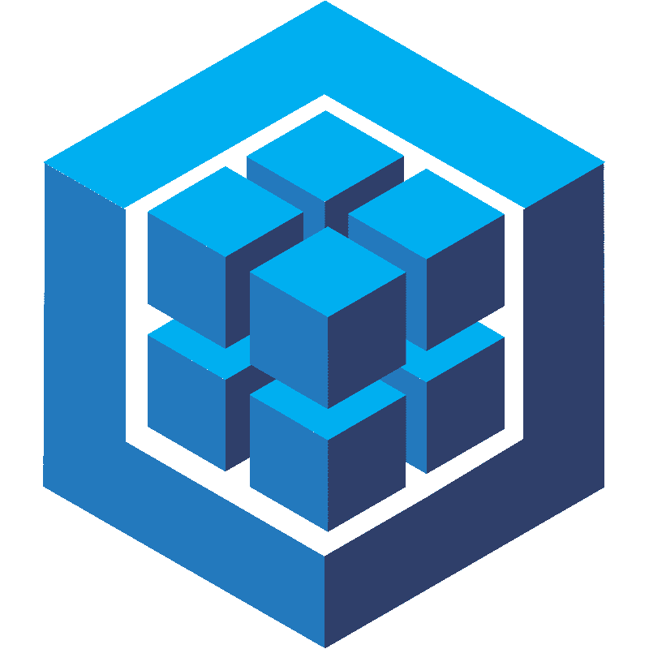

<!-- CATCH YOU! MY LITTLE RESEARCHER 😉 -->

         

------------------------------------------------------------------------------

# 🌟 Favorites

    
    
    
    

# 🔎 Contact

    

           
    

    

          
    

# 😇 About

    <b><i>
        
Developer from Russia. I study Python and Java at the university.

        
Was engaged in writing websites, actively using Java Script.

        
Love readable and well-structured code

        
Do photoshop and photograph

    </i></b>

# 💪 Skills

    

        
        
        
    

    

        
        
        
    

## 👅 Languages

     
    <b>Java</b>
     
    <b>Python</b>
    
    <b>TypeScript</b>

## 👀 FrontEnd

     
    <b>Vue</b>
     
    <b>JQuery</b>
     
    <b>Sass</b>
    
    <b>Pug</b>

## 📡 BackEnd

     
    <b>Flask</b>
     
    <b>NodeJS</b>
     
    <b>Express</b>
     
    <b>Spring Web</b>

## 💿 DataBase

     
    <b>Mongoose</b>
     
    <b>MongoDB</b>
     
    <b>Spring Data</b>
     
    <b>Sequelize</b>
     
    <b>PostgreSQL</b>

## ✏️ Graphics

     
    <b>Photoshop</b>
     
    <b>Illustrator</b>
     
    <b>Figma</b>

## 📜 Others

    
    
    
    
    
    
    
    
    
    
    
    
    

# 📊 Statistics

    

    

 

    

 

<h3 align="right"> 💜 Thanks for reading </h3>
